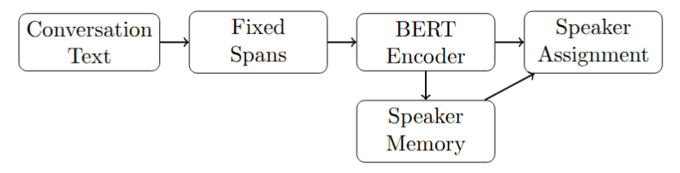
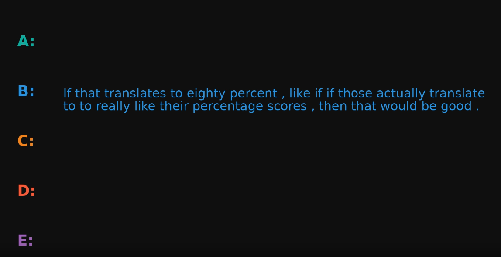

# ContextDiarist  
## Text-Based Speaker Diarization with Speaker Memory

This repository contains the code for a **text-only speaker diarization system** that models speaker identity using a **learned speaker memory**, without relying on acoustic features.

The project investigates whether **speaker turns can be recovered from text structure alone**, and compares the proposed methods against classical text segmentation, LLM-based approaches, and WhisperX.

---

## 1. Project Motivation

Speaker diarization is traditionally treated as an **audio-based problem**, relying on acoustic embeddings and voice characteristics.

However, many real-world scenarios involve:
- noisy or degraded audio,
- missing audio streams,
- or downstream tasks that operate purely on text.

This project explores whether **speaker identity can be inferred from textual patterns alone**, using:
- lexical choice,
- discourse structure,
- and long-range consistency across turns.

---

## 2. Problem Statement

**Given a conversation transcript with no speaker labels**, assign a speaker identity to every word or segment, using **text only**.

Formally:
- **Input**: unsegmented conversational text
- **Output**: speaker labels per word / segment

The challenge is to maintain **speaker consistency** across distant turns without acoustic cues.

---

## 3. Visual Abstract

Core pipeline (high-level):

Speaker identity is modeled as a **persistent memory state**, not as a static embedding.

---

## 4. Datasets Used

- **AMI Meeting Corpus (text-only version)**
  - multi-speaker meeting transcripts
  - ground-truth speaker annotations

Experiments are conducted on:
- clean transcripts
- ASR-generated transcripts (via WhisperX)

---

## 5. Data Augmentation and Generation

The dataset pipeline supports:
- sampling random contiguous chunks (fixed *word budget*)
- optional overlap scrambling augmentation (disabled for ASR evaluation)

No synthetic speakers or external text corpora are introduced.

---

## 6. Input / Output Examples

**Input**

okay so the next slide shows the results yeah I think that makes sense can you go back one slide

**Output**
[A] okay so the next slide shows the results
[B] yeah I think that makes sense
[A] can you go back one slide

---

## 7. Models and Pipelines Used

### Baselines
- TextTiling
- LLM-based text segmentation
- WhisperX (ASR + audio-based diarization)

### Proposed Models
1. **BERT Encoder + Speaker Memory (Fixed Spans)**
2. **Hybrid Incremental Span Construction (Next-Token Inspired)**

Both models use:
- frozen `bert-base-uncased` span encoder
- learnable **speaker memory** updated with a GRU

---

## 8. Speaker Memory Model (Core Contribution)

The speaker memory is a **learned, persistent representation** of each speaker that evolves over time.

**Key idea**
- BERT encodes *what is said* (local content)
- speaker memory encodes *who is speaking* (global identity over time)

### Why speaker memory?
Without memory, span classification tends to be unstable:
- assignments can collapse to one dominant speaker
- short acknowledgements (“yeah”, “okay”) become ambiguous
- long-range consistency is not enforced

Memory allows the model to:
- accumulate speaker-specific traits
- enforce long-range consistency
- distinguish speakers even when local text is ambiguous

### Why a GRU?
- sequential, gated updates (controlled integration of new spans)
- lightweight and stable for online inference
- natural fit for conversation streams

---

## 9. Training Process and Parameters

### Training view (supervised)
- input: spans + ground-truth speaker IDs
- loss: **span-level cross-entropy**
- memory updates: **teacher forcing** (update only the true speaker memory)

### Typical settings
- encoder: frozen BERT
- optimizer: AdamW
- speaker imbalance handled with per-speaker loss reweighting

---

## 10. Inference Process

At inference time:
- no ground-truth speaker labels are available
- speaker memories are updated **online**
- spans (or incrementally grown segments) are assigned sequentially

Inference modes:
- fixed-span peeling assignment
- hybrid incremental span growth (next-token inspired)

---

## 11. Metrics

Evaluation is performed at the **word level**:
- word-level speaker accuracy
- segment consistency accuracy
- boundary F1 score
- alignment coverage

---

## 12. Results

The proposed **BERT + Speaker Memory** model:
- improves over fixed-span baselines
- benefits significantly from incremental span construction
- remains functional under ASR noise

(See the Results tables in the project presentation.)

---

## 13. Repository Structure

.
├── data/                 # AMI dataset loaders
├── speaker_model.py      # Speaker memory model
├── spans.py              # Span construction logic
├── train_lit.py          # Training script
├── eval_*.py             # Evaluation pipelines
├── nltk_utils.py         # Metrics and alignment
└── README.md

## 14. Team Members
  - Yoav Ellinson
  - Alexandra Simanovsky

## Key Takeaway

Speaker diarization can be reframed as a text-based identity modeling problem, where persistent speaker memory replaces acoustic embeddings.

## Future Work

- integrate acoustic features with speaker memory

- extend to long-context, full-meeting diarization

- evaluate cross-domain generalization beyond AMI